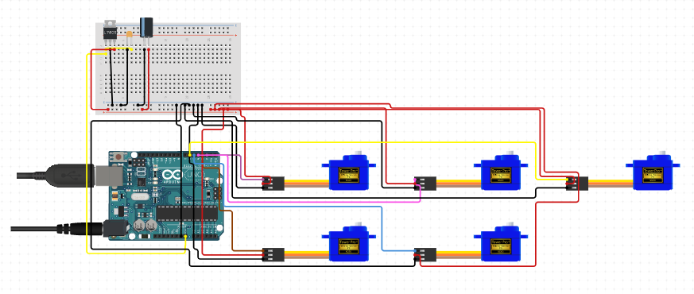

# Teleoperated Robotic Hand

## Description
The biomechatronic system consists of a robotic hand that replicates the movements of an
operator to simulate real-life teleoperation. The system components include the hand in question, 
along with an Arduino that implements the gesture replication algorithm based on sensory information 
captured by a camera in front of which the operator stands and executes several movements.

## Circuit Diagram

